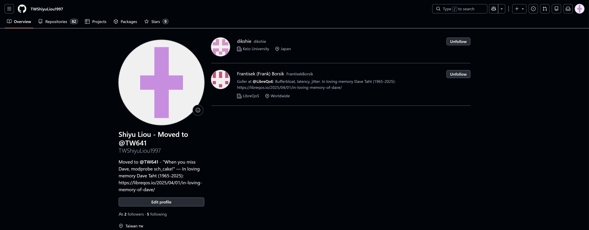
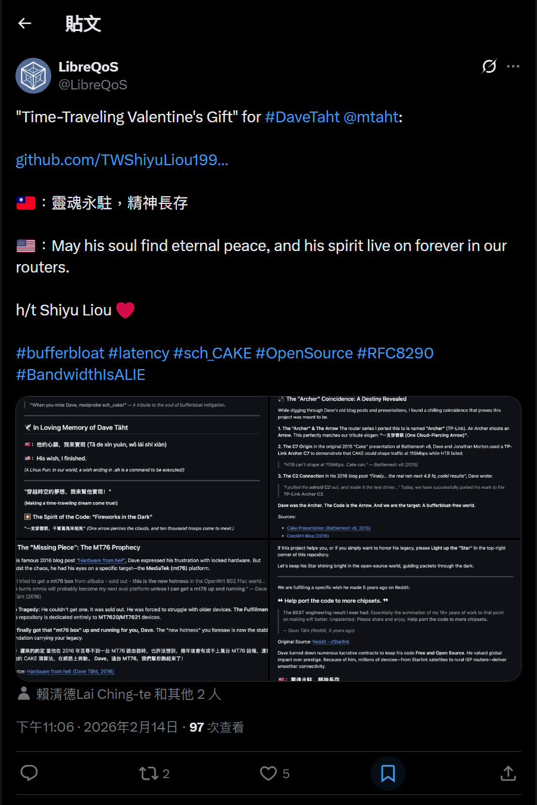
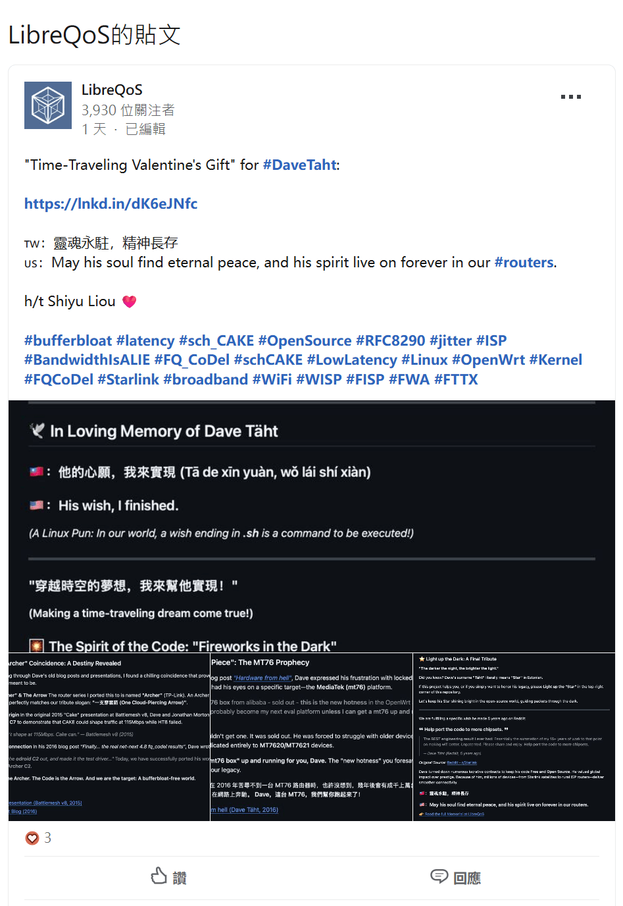
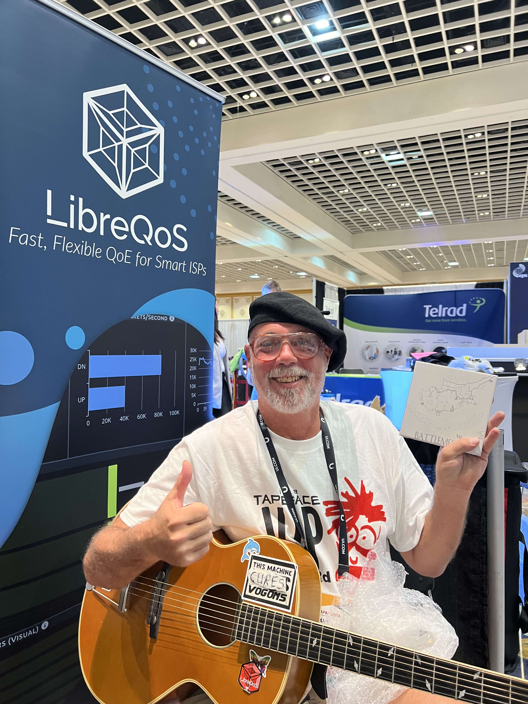
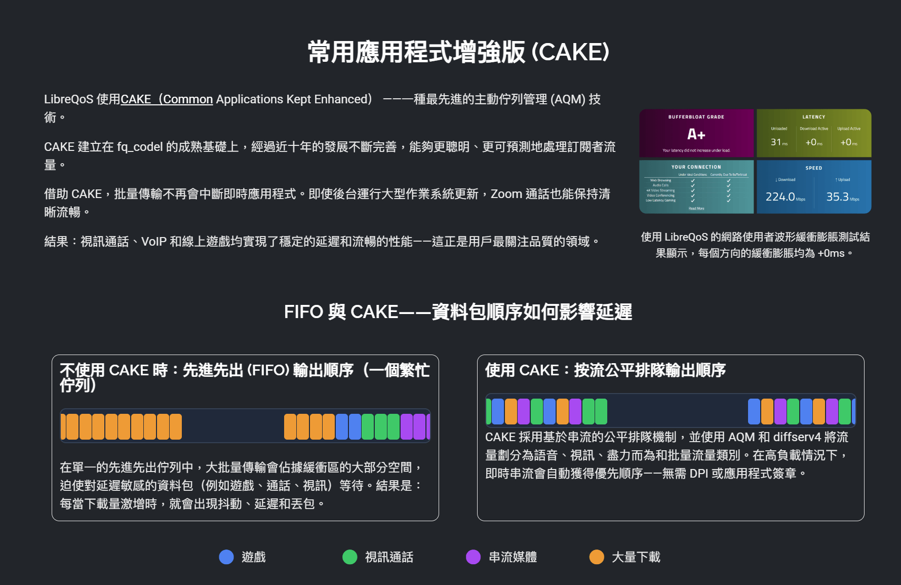
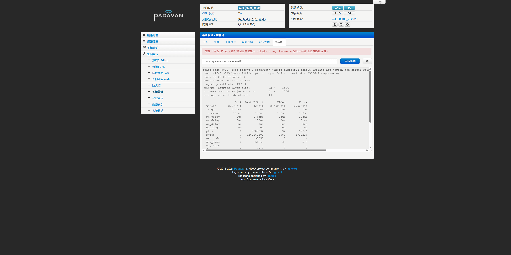

# [Padavan-CAKE](https://TW641.github.io/Padavan-CAKE/)

> 繁體中文 | [简体中文](README_CN.md) | [English](README.md)

 

## 🏆 🇹🇼 全球首發！Taiwan No.1！ 🇹🇼

## 🚀 改善網路延遲！TW641 移植 CAKE (sch_cake) Padavan 路由器韌體：雲端編譯懶人包 (支援 142 款機型)

**For English version, please visit: [https://www.mobile01.com/topicdetail.php?f=110&t=7231531#92875608](https://www.mobile01.com/topicdetail.php?f=110&t=7231531#92875608)**

**繁體中文版本，請見：[https://www.mobile01.com/topicdetail.php?f=110&t=7231531#92875605](https://www.mobile01.com/topicdetail.php?f=110&t=7231531#92875605)**

👉 **上一篇韌體分享、實測結果與刷機教學：**

[韌體分享]【Padavan + CAKE 移植】TP-Link Archer C2 V1 (with 3.4.113 Linux Kernel) & 斐訊 Phicomm K2P A1/A2 (with 4.4.198 Linux Kernel)

[https://www.mobile01.com/topicdetail.php?f=110&t=7220226](https://www.mobile01.com/topicdetail.php?f=110&t=7220226)

這是我個人獨立完成、世界上第一個成功將 **CAKE 流量控制演算法**移植到 Padavan (包含 Linux Kernel 3.4.113 與 Linux Kernel 4.4.198 兩種 Linux 核心版本) 的**本專案**！

我不僅復活了經典的 TP-Link Archer C2 與 斐訊 Phicomm K2P，這次更加碼擴充支援機型選項，**一口氣精準支援 142 種路由器機型選項**，並擁有多達 **14 種多國語言包的支援**！

## 📌 韌體版本特色速覽

* **核心突破：** 提供 Linux Kernel 3.4.113 與 4.4.198 雙版本，大幅領先原廠舊核心。
* **效能解放：** 全系列整合 CAKE 流量調度、HWNAT (硬體加速) + SFE (軟體加速)。
* **介面優化：** 內建繁體中文，並針對 1080P 寬螢幕進行排版優化。
* **穩定提升：** 修復 MT7610E 無線驅動斷線問題，啟用快速重連；4.4 版本採用最穩定的 Iptables 1.8.7 與 libmnl 1.0.5 組合。
* **安全防護：** 全面升級 Busybox 1.37.0，修復多個 CVE 高風險漏洞。

*(註：我先前的舊專案放在舊帳號 TWShiyuLiou1997，現在成功運作的成品都會集中在新的 **TW641** 帳號中，兩個首頁我都放在下面，請以新倉庫的 Actions 為主喔！如果您覺得這個專案有幫助到您，請幫我點選下方連結 **Follow** 我的 GitHub 帳號給予支持與鼓勵！)*

👉 我的全新 GitHub 首頁 (TW641)：[https://github.com/TW641](https://github.com/TW641)

👉 我的舊版 GitHub 首頁 (TWShiyuLiou1997)：[https://github.com/TWShiyuLiou1997](https://github.com/TWShiyuLiou1997)

---

## 🌍 來自國際開源界與總統級的肯定！(真正的數位國民外交)

**這個專案**不僅成功在台灣論壇發布，更在國際開源社群引起了巨大的迴響，這對身為唯一開發者的我來說，是極大的肯定與驚喜：

* **🇹🇼🤝🇨🇿 來自捷克的國際開源大神的親自認可：**
    我的 GitHub 專案成功獲得了 **LibreQoS 營運長 Frantisek (Frank) Borsik** 的親自追蹤與肯定！Frank 來自**捷克布拉格地區**，在國際開源網路界大有來頭，曾負責知名開源路由器 Turris (OpenWrt) 以及 RF elements 的核心推廣。這代表**本專案**已經成功打入全球「對抗 Bufferbloat (緩衝膨脹)」社群的最核心圈！能與來自友好捷克的專家交流，真的是莫大的榮幸。

* **🇹🇼🤝🇯🇵 來自日本的頂尖網路學者的跨國關注：**
    來自日本頂尖名校 **慶應義塾大學 (Keio University) 的 Dikshie 博士** 也親自給予**此專案**關注與認可！Dikshie 博士專攻 P2P 網路、網際網路架構與網路科學，能獲得這類精於底層網路基礎設施的重量級學者肯定，證明了這份演算法移植的技術含金量極高！
    
    

    *[圖說：來自捷克 LibreQoS 營運長與日本慶應大學頂尖學者的親自追蹤認可]*

* **🇹🇼 總統級的數位國民外交：**
    LibreQoS 官方甚至在 X (Twitter)、Facebook 與 LinkedIn 等國際社群平台上發布**貼文致敬**，將**這個專案**譽為給 Dave Täht 的 **"Time-Traveling Valentine's Gift" (穿越時空的情人節禮物)**，並在文中史無前例地標註了**台灣總統賴清德、前總統蔡英文與總統府發言人**！能讓台灣的開源技術貢獻躍上國際版面，這真的是貨真價實的國民外交！🇹🇼
    
    

    
    
    
    

    *[圖說：LibreQoS 官方於 Facebook、X 與 LinkedIn 三大平台同步發文致敬]*

**👇 需要大家的火力支援！讓世界看見台灣的貢獻！👇**
如果你也為這份「數位國民外交」感到熱血沸騰，懇請花個 10 秒鐘，點選下方的 LibreQoS 官方社群貼文連結，幫忙 **按讚、留言、分享**！讓這份來自台灣的跨國界致敬傳遞給全世界：

* 👉 **X (Twitter) 貼文按讚分享：** [https://x.com/LibreQoS/status/2022688823361126545](https://x.com/LibreQoS/status/2022688823361126545)

* 👉 **Facebook 貼文按讚分享：** [https://www.facebook.com/libreqos/posts/...](https://www.facebook.com/libreqos/posts/pfbid02JCNKynFeQ48FdBMFbVoAoWFDLfgiA55mH3Fyz76xKHdEU86XkxgVziWzXoRYbbT1l)

* 👉 **LinkedIn 貼文按讚分享：** [https://www.linkedin.com/posts/libreqos...](https://www.linkedin.com/posts/libreqos_davetaht-routers-bufferbloat-activity-7428458742301659136-YAL2)

---

## 🕊️ In Loving Memory of Dave Täht (紀念緩衝膨脹緩解之魂)

*[圖片來源: LibreQoS]*

> **"When you miss Dave, modprobe sch_cake!"**
> 
> — *A tribute to the soul of bufferbloat mitigation.*

### **🇹🇼：他的心願，我來實現 (Tā de xīn yuàn, wǒ lái shí xiàn)**
### **🇺🇸：His wish, I finished.**

Dave Täht (1965–2025) 是一位偉大的網路技術開源貢獻者。他生前拒絕了無數高薪合約，只為了將他的程式碼保持免費與開源。因為他在 Bufferbloat (緩衝膨脹) 領域的研究，今天無數的設備才能享有順暢的網路。

**🏹 穿越時空的巧合：Archer (弓箭手) 與 Arrow (箭)**

有句成語說：**「一支穿雲箭，千軍萬馬來相見」

** Dave 就像是那支劃破網路壅塞黑夜的穿雲箭。巧合的是，當年他於 2015 年展示 CAKE 演算法時，使用的測試機是 **TP-Link Archer C7**；2016 年他用 **odroid C2** 做測試驅動。 

今天，我成功將他的這項**遺作**移植到了 **TP-Link Archer C2** 身上。Dave 是那位弓箭手 (Archer)，這段程式碼是那支箭 (Arrow)，而我成功命中了目標：一個沒有 Bufferbloat 的美好世界。

**🧩 遲來的約定：MT76 的預言**

2016 年，Dave 曾在**部落格**寫下他苦尋不到一台基於 MediaTek (MT76) 的路由器，他預言這會是未來開源網路的新星。

幾年後的今天，我透過**這個專案**，讓成千上萬台 MT76 設備順利跑起了他撰寫的 CAKE 演算法。

**"Dave，這台 MT76，我終於幫你跑起來了！"**

**🌟 點亮星星，讓愛延續**

Dave 的姓氏 **"Täht"** 在愛沙尼亞語中正是**「星星」**的意思。如果您使用了我的韌體，請到 GitHub 開源專案紀念倉庫上幫我點亮那顆「Star」，延續 Dave Täht 的精神！

👉 開源移植程式碼與紀念倉庫： [https://github.com/TW641/sch_cake](https://github.com/TW641/sch_cake)

👉 閱讀完整的 Dave Täht 紀念文章 (LibreQoS)： [https://libreqos.io/2025/04/01/in-loving-memory-of-dave/](https://libreqos.io/2025/04/01/in-loving-memory-of-dave/)

---

## 🔧 科普小教室｜為什麼你的網路需要 CAKE？

CAKE 建立在 fq_codel 的成熟基礎上，是一種最先進的主動佇列管理 (AQM) 技術。借助 CAKE，大量傳輸不再中斷即時應用程式。即使家人在下載大檔案，你的線上遊戲依然能維持低 Ping 值✅。

### 🍰 為什麼叫 "CAKE" (蛋糕)？

這個名字源自電影《2010》與遊戲《Portal》，代表著「人人都有蛋糕吃」的美好願景。它實際上是 Common Applications Kept Enhanced 的縮寫。簡單來說，它能讓網路在多人使用時，依然人人有頻寬，順暢不卡頓。

### ⚙️ 快速看懂運作原理

CAKE 最主要的目標是消除 Bufferbloat（緩衝膨脹）。

**它的核心功能：**
* **流量整形 (Shaping)：** 限制進出頻寬，確保**網路封包**不會在數據機等節點堆積。
* **公平排隊 (Fair Queuing)：** 確保每個裝置都能公平分配到頻寬，防止單一程式霸佔網路。
* **自動化管理：** 相比舊型的 QoS，CAKE 通常只需設定下載與上傳頻寬即可達到極佳效果。

⚠️ **注意：** CAKE 比較消耗 CPU 效能。在硬體較弱的路由器上處理超過 350 Mbps 以上的頻寬時，可能會成為效能瓶頸。

### 🔍 怎麼確認 CAKE 完美運行

    
    
    
    

---

## 🚀 Supported Device Matrix (精準支援 142 種機型選項清單)

請先在下方找到你的路由器品牌與商品名稱，括號 `( )` 內的就是稍後在 GitHub 編譯選單中需要輸入的**「選項代碼」**！

### 🟢 Kernel 3.4 經典老爺機 (共 125 種選項)

| 品牌 (A-Z) | 支援型號：商品名稱 `(選項代碼)` |
| :--- | :--- |
| **5K** | 5K-W20 `(5K-W20)` |
| **A5** | A5-V11 16M `(A5-V11_16M)`, A5-V11 4M `(A5-V11_4M)`, A5-V11 8M `(A5-V11_8M)` |
| **ATEL** | ALR-U270 `(ALR-U270)` |
| **ASUS (華碩)** | RP-AC56 `(RP-AC56)`, RT-AC1200 `(RT-AC1200)`, RT-AC1200GU `(RT-AC1200GU)`, RT-AC1200HP `(RT-AC1200HP)`, RT-AC51U `(RT-AC51U)`, RT-AC54U `(RT-AC54U)`, RT-N10 C1 `(RT-N10C1)`, RT-N11P `(RT-N11P)`, RT-N11P B1 `(RT-N11PB1)`, RT-N12+ `(RT-N12plus)`, RT-N13U B1 `(RT-N13UB1)`, RT-N14U `(RT-N14U)`, RT-N56U `(RT-N56U)`, RT-N56U GE2 `(RT-N56U-GE2)`, RT-N56U B1 `(RT-N56UB1)` |
| **BELKIN** | F9K1103 `(F9K1103)` |
| **D-Link (友訊)** | DIR-300 B1 `(DIR-300B1)`, DIR-300 B7 `(DIR-300B7)`, DIR-320 B1 `(DIR-320B1)`, DIR-620 A1 `(DIR-620A1)`, DIR-620 D1 `(DIR-620D1)`, DIR-860L `(DIR-860L)`, DIR-882 `(DIR-882)` |
| **GL.iNet** | GL-MT300A `(GL-MT300A)`, GL-MT300N `(GL-MT300N)`, GL-MT300N V2 `(GL-MT300NV2)` |
| **HiWiFi (極路由)** | HC5661A `(HC5661A)` |
| **Kroks** | KNDRT31R26 `(KNDRT31R26)`, KNDRT31R3 `(KNDRT31R3)` |
| **Linksys** | EA-8100 `(EA-8100)` |
| **MQMaker** | WiTi 256M `(MQ-WITI-256)`, WiTi 512M `(MQ-WITI-512)` |
| **Newifi (新路由)** | Newifi D1 `(NEWIFI-D1)`, Newifi D2 `(NEWIFI-D2)`, Newifi Mini `(NEWIFI-MINI)`, Newifi Y1S `(NEWIFI-Y1S)` |
| **Nexx** | WT3020A `(WT3020A)`, WT3020H `(WT3020H)`, WT3020H 16M `(WT3020H16M)` |
| **Phicomm (斐訊)** | PSG1218 256M `(256PSG1218)`, PSG1218 `(PSG1218)` |
| **Samsung (三星)** | SWR1100 `(SWR1100)` |
| **Sercomm** | RT-S1010 `(RT-S1010)`, Smartbox SPI `(SMARTBOX_SPI)`, SMBX Pro NAND `(SMBXPRONAND)`, SMBX Turbo `(SMBXTURBO)` |
| **SNR** | SNR-MD1 `(SNR-MD1)`, SNR-ME1 `(SNR-ME1)`, SNR-W4N-M `(SNR-W4N-M)`, SNR-W4N-M USB `(SNR-W4N-M_USB)` |
| **Totolink** | A3004NS `(A3004NS)` |
| **TP-Link** | Archer C2 V1 `(TL_C2-V1)`, Archer C20 V1 `(TL_C20-V1)`, Archer C20 V1 16M `(TL_C20-V1_16M)`, Archer C20 V4 `(TL_C20-V4)`, Archer C20 V5 `(TL_C20-V5)`, Archer C5 V4 `(TL_C5-V4)`, Archer C50 V1 `(TL_C50-V1)`, Archer C50 V3 `(TL_C50-V3)`, Archer C50 V4 `(TL_C50-V4)`, EC220-G5 V2 `(TL_EC220_G5-V2)`, MR200 V1 `(TL_MR200-V1)`, MR3020 V3 `(TL_MR3020-V3)`, MR3420 V5 `(TL_MR3420-V5)`, WDR7300 V5 `(TL_WDR7300-V5)`, WR840N V4 `(TL_WR840N-V4)`, WR840N V4 USB `(TL_WR840N-V4_USB)`, WR840N V5 `(TL_WR840N-V5)`, WR840N V5 RU `(TL_WR840N-V5_RU)`, WR840N V6 `(TL_WR840N-V6)`, WR841N V13 `(TL_WR841N-V13)`, WR841N V13 USB `(TL_WR841N-V13_USB)`, WR841N V14 `(TL_WR841N-V14)`, WR841N V14 8M `(TL_WR841N-V14_8M)`, WR842N V5 `(TL_WR842N-V5)`, WR845N V3 `(TL_WR845N-V3)`, WR845N V4 `(TL_WR845N-V4)` |
| **Tuoshi** | TS7620N `(TS7620N)` |
| **Ubiquiti** | EdgeRouter X `(UBNT-ERX)` |
| **Unielec** | U7621-06 `(U7621-06)` |
| **Wall-AP** | Wall-AP `(WALL-AP)` |
| **Xiaomi (小米/紅米)** | Mi Router 3 `(MI-3)`, Mi Router 3 SPI `(MI-3_SPI)`, Mi Router 3C `(MI-3C)`, Mi Router 3G `(MI-R3G)`, Mi Router 3G SPI `(MI-R3G_SPI)`, Mi Router 3G v2 `(MI-R3Gv2)`, Mi Router 3 Pro `(MI-R3PRO)`, Mi Router 3P SPI `(MI-R3P_SPI)`, Mi Router 4 `(MI-4)`, Mi Router 4A 100M `(MI-4A_100M)`, Mi Router 4C `(MI-4C)`, Mi Router Mini `(MI-MINI)`, Mi Router Nano `(MI-NANO)`, Xiaomi Router 2100 `(R2100)`, Redmi Router AC2100 `(RM-AC2100)` |
| **Youhua (友華)** | WR1200JS `(WR1200JS)` |
| **Youku (優酷)** | YK-L1 `(YK-L1)`, YK-L1C `(YK-L1C)` |
| **ZBT** | WE1326 `(ZBT-WE1326)`, WE1626 `(ZBT-WE1626)`, WE826-T2 `(ZBT-WE826T2)`, WG3526 `(ZBT-WG3526)`, WG3526-32 `(ZBT-WG3526-32)`, WR8305RT `(ZBT-WR8305RT)` |
| **ZTE (中興)** | E8820S `(ZTE_E8820S)` |
| **ZyXEL (合勤/Keenetic)** | KN-4G3 `(KN-4G3)`, KN-4G3B `(KN-4G3B)`, KN-EXTRA `(KN-EXTRA)`, KN-EXTRA2 `(KN-EXTRA2)`, KN-GIGA3 `(KN-GIGA3)`, KN-LITE `(KN-LITE)`, KN-LITE2 `(KN-LITE2)`, KN-LITE3 `(KN-LITE3)`, KN-LITE3B `(KN-LITE3B)`, KN-OMNI `(KN-OMNI)`, KN-OMNI2 `(KN-OMNI2)`, KN-START2 `(KN-START2)`, KN-ULTRA2 `(KN-ULTRA2)`, KN-VIVA `(KN-VIVA)` |

### 🔵 Kernel 4.4 進階機型 (共 17 種選項)

| 品牌 (A-Z) | 支援型號：商品名稱 `(選項代碼)` |
| :--- | :--- |
| **D-Link (友訊)** | DIR-878 `(DIR-878)`, DIR-882 `(DIR-882)` |
| **JCG (捷稀)** | 836PRO `(JCG-836PRO)`, AC860M `(JCG-AC860M)`, Q20 `(JCG-Q20)`, Y2 `(JCG-Y2)` |
| **Motorola (摩托羅拉)** | MR2600 `(MR2600)` |
| **Netgear (網件)** | BZV `(NETGEAR-BZV)` |
| **Newifi (新路由)** | Newifi 3 `(NEWIFI3)` |
| **Phicomm (斐訊)** | K2P `(K2P)`, K2P Nano `(K2P-NANO)`, K2P USB `(K2P-USB)` |
| **Xiaomi (小米/紅米)** | CR660x `(CR660x)`, Mi Router 3G `(MI-R3G)`, Mi Router 3 Pro `(MI-R3P)`, Redmi Router 2100 `(RM2100)` |
| **XiaoYu (小漁)** | XY-C1 `(XY-C1)` |

---

## 🌐 支援 14 種多國語言

我相信網路無國界，現在韌體編譯環境已支援 14 種語言：

* **English_Only** (預設英文)
* **CN** - **繁體中文 (臺灣用語)**，請在選單填入 `CN` 即可獲得。
* 另外包含：俄語 (RU), 捷克語 (CZ), 德語 (DE), 法語 (FR) 等共 14 國語言。

---

## 🍰 A PIECE OF CAKE！超簡單、超輕鬆的雲端編譯法 (免架環境，5分鐘搞定！)

這真的是 Piece of cake！我已經把所有設定都寫進 GitHub Actions 裡了。你完全不需要會寫程式，只要會點選滑鼠，幾分鐘就能得到專屬你的韌體檔！

### **👉 簡單 6 步驟：**

**Step 1：註冊登入 GitHub 並點亮「星星」🌟 (紀念 Dave Täht)**

前往 GitHub 註冊一個免費帳號並登入。請前往專案紀念倉庫，順手**點選**右上角的 **「Star ⭐」** 向 Dave 致敬！

👉 [https://github.com/TW641/sch_cake](https://github.com/TW641/sch_cake)

**Step 2：選擇你的路由器機型並 Fork 專案**

根據你剛剛在上方表格找到的代號，進入對應連結後，**點選**右上角的 **「Fork」** 按鈕：

🟢 **經典老機 (核心 3.4)** 👉 [https://github.com/TW641/padavan-builder-workflow](https://github.com/TW641/padavan-builder-workflow)

🔵 **進階機型 (核心 4.4)** 👉 [https://github.com/TW641/padavan-4.4](https://github.com/TW641/padavan-4.4)

**Step 3：啟用 Actions 功能**

進入你剛 Fork 的專案，**點選**上方選單的 **「Actions」**，並**點選**綠色按鈕 **「I understand my workflows, go ahead and enable them」** 啟用它。

**Step 4：選擇正確的 Workflow**

在 Actions 頁面左側，根據機型**點選**對應的流程名稱：

🟢 **3.4 機型：** `Build firmware (Ultimate Fix - Early Size Check)`

🔵 **4.4 機型：** `Custom-Router-Build-Final-Fix`

**Step 5：一鍵開始編譯與自訂參數 (IP/密碼)**

**點選**畫面右邊的 **「Run workflow」** 下拉選單。

**【最重要的一步】** 在 `Target Model` 欄位中輸入你的**「路由器選項代碼」**(需與表格括號內一模一樣)；語言選單請填入 `CN` (即代表**繁體中文，臺灣用語**)。

**自訂設定 (Customization)：** 你可以在 JSON 欄位中直接修改預設 IP 與密碼，若不修改，將使用預設值。最後**點選**綠色的 **「Run workflow」** 按鈕即可！

**Step 6：下載與刷機**

等待約 10~15 分鐘，流程亮起綠色打勾圖示 ✅ 後，**點選**進去該次流程，拉到最下方找到 **「Artifacts」** 下載壓縮檔，裡面的 `.bin` 檔案就是你的專屬韌體！
